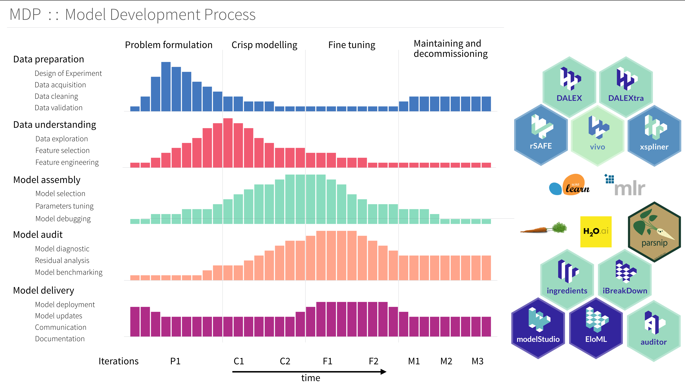
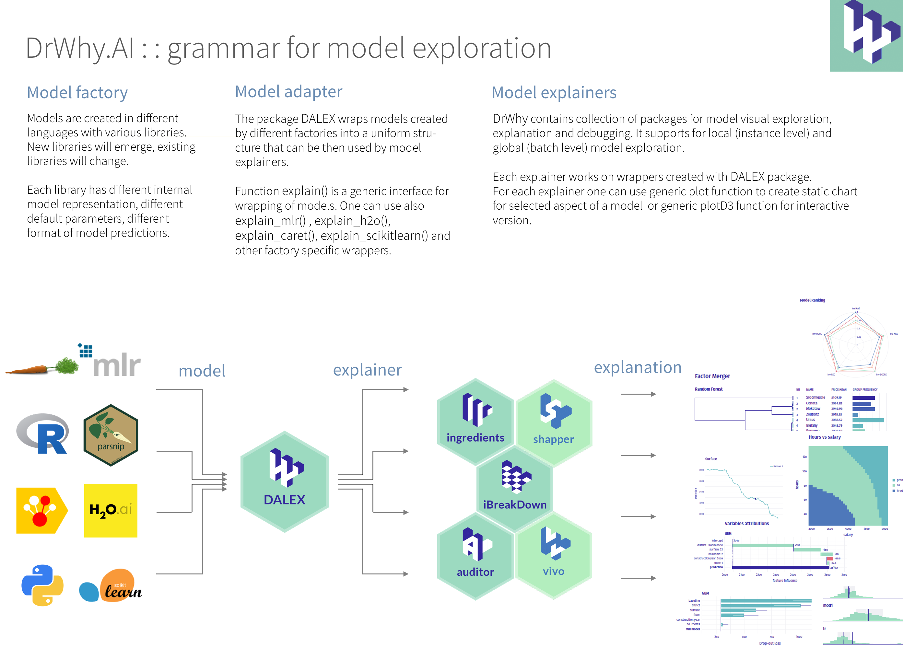
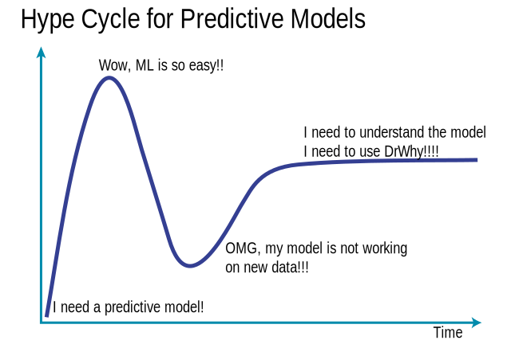

# Responsible Machine Learning

*With Great Power Comes Great Responsibility*. 
Voltaire (well, maybe)

How to develop machine learning models in a responsible manner? There are several topics worth considering:

* **Effective**. Is the model good enough? Models with low performance should not be used because they can do more harm than good. Communicate the performance of the model in a language that the user understands. Remember that the models will work on a different dataset than the training one. Make sure to assess the performance on the target dataset.

* **Transparent**. Does the user know what influences model predictions? Interpretability and explainability is important. If the model decisions affect us directly or indirectly, we should know where these decisions come from and how they can be changed.

* **Fair**. Does the model discriminate on the basis of gender, age, race or other sensitive attribute? Direct or indirect? It should not! Discrimination can come in many faces. The model may give lower scores, may have lower performance, or may be based on different variables for the protected population.

* **Secure**. Do not let your model be hacked. Every complex system has its vulnerabilities. Seek them out and fix them. Some users may use various tricks to pull model predictions onto their site.

* **Confidential**. Models are often built on sensitive data. Make sure that the data does not leak, so that sensitive attributes are not shared with unauthorized persons. Also beware of model leaks. 

* **Reproducible**. Usually the model development process consists of many steps. Make sure that they are completely reproducible and thus can be verified one by one.

# Collection of tools for Visual Exploration, Explanation and Debugging of Predictive Models

*It takes a village to raise a <del>child</del> model*.

The way how we do predictive modeling is very ineffective. We spend way too much time on manual time-consuming and easy to automate activities like data cleaning and exploration, crisp modeling, model validation. We should be focusing more on model understanding, productisation and communication.

Here are gathered tools that can be used to make out work more efficient through the whole model lifecycle.
The unified grammar beyond DrWhy.AI universe is described in the [Explanatory Model Analysis: Explore, Explain and Examine Predictive Models](https://pbiecek.github.io/ema/) book.

## Lifecycle for Predictive Models

The DrWhy is based on an unified [Model Development Process](https://github.com/ModelOriented/DrWhy/blob/master/images/ModelDevelopmentProcess.pdf) inspired by RUP. Find an overview in the diagram below.

## The DrWhy.AI family

Packages in the `DrWhy.AI` family of models may be divided into four classes.

* **Model adapters**. Predictive models created with different tools have different structures, and different interfaces. Model adapters create uniform wrappers. This way other packages may operate on models in an unified way. `DALEX` is a lightweight package with generic interface. `DALEXtra` is a package with extensions for heavyweight interfaces like `scikitlearn`, `h2o`, `mlr`.

* **Model agnostic explainers**. These packages implement specific methods for model exploration. They can be applied to a single model or they can compare different models. `ingredients` implements variable specific techniques like Ceteris Paribus, Partial Dependency, Permutation based Feature Importance. `iBreakDown` implements techniques for variable attribution, like Break Down or SHAPley values. `auditor` implements techniques for model validation, residual diagnostic and performance diagnostic.

* **Model specific explainers**. These packages implement model specific techniques. `randomForestExplainer` implements techniques for exploration of `randomForest` models. `EIX` implements techniques for exploration of gbm and xgboost models. `cr19` implements techniques for exploration of survival models. 

* **Automated exploration**. These packages combine series of model exploration techniques and produce an automated report of website for model exploration. `modelStudio` implements a dashboard generator for local and global interactive model exploration. `modelDown` implements a HTML website generator for global model cross comparison. 

Here is a more detailed overview.

--------------------

### [DALEX](http://github.com/ModelOriented/DALEX) 

   

The DALEX package (Descriptive mAchine Learning EXplanations) helps to understand how complex models are working. The main function [explain](https://modeloriented.github.io/DALEX/reference/explain.html) creates a wrapper around a predictive model. Wrapped models may then be explored and compared with a collection of local and global explainers. Recent developments from the area of Interpretable Machine Learning/eXplainable Artificial Intelligence.

DALEX wraps methods from other packages, i.e. 'pdp' (Greenwell 2017) <doi:10.32614/RJ-2017-016>, 'ALEPlot' (Apley 2018) <arXiv:1612.08468>, 'factorMerger' (Sitko and Biecek 2017) <arXiv:1709.04412>,  'breakDown' package (Staniak and Biecek 2018) <doi:10.32614/RJ-2018-072>, (Fisher at al. 2018) <arXiv:1801.01489>.

Vignettes: 

* [General introduction: Survival on the RMS Titanic](https://modeloriented.github.io/DALEX/articles/vignette_titanic.html)

--------------------

### [DALEXtra](http://github.com/ModelOriented/DALEXtra)  

    

The `DALEXtra` package is an extension pack for [DALEX](https://modeloriented.github.io/DALEX) package.
This package provides easy to use connectors for models created with scikitlearn, keras, H2O, mljar and mlr.

Vignettes: 

* [General introduction: DALEX with scikitlearn models](https://raw.githack.com/pbiecek/DALEX_docs/master/vignettes/How_to_use_DALEXtra_to_explain_and_visualize_scikitlearn_models.html)

--------------------

### [survex](http://github.com/ModelOriented/survex)  

    

The survex package provides model-agnostic explanations for machine learning survival models. It is based on the DALEX package.

Due to a functional type of prediction, either in the form of survival function or cumulative hazard function, standard model-agnostic explanations cannot be applied directly to survival analysis machine learning models. The survex package contains implementations of explanation methods specific to survival analysis, as well as extensions of existing ones for classification or regression.

Vignettes:

* [Package usage](https://modeloriented.github.io/survex/articles/survex-usage.html)
* [Creating custom explainers](https://modeloriented.github.io/survex/articles/custom-explainers.html)
* [Integration with `mlr3proba`](https://modeloriented.github.io/survex/articles/mlr3proba-usage.html)

--------------------

### [ingredients](http://github.com/ModelOriented/ingredients)  

    

The `ingredients` package is a collection of tools for assessment of feature importance and feature effects.

Key functions: `feature_importance()` for assessment of global level feature importance, `ceteris_paribus()` for calculation of the Ceteris Paribus / What-If Profiles, `partial_dependency()` for Partial Dependency Plots, `conditional_dependency()` for Conditional Dependency Plots also called M Plots, `accumulated_dependency()` for Accumulated Local Effects Plots,  `cluster_profiles()` for aggregation of Ceteris Paribus Profiles, generic `print()` and `plot()` for better usability of selected explainers, generic `plotD3()` for interactive D3 based explanations, and generic `describe()` for explanations in natural language.

Vignettes: 

* [General introduction: Survival on the RMS Titanic](https://modeloriented.github.io/ingredients/articles/vignette_titanic.html),
* [Aspects importance](https://modeloriented.github.io/ingredients/articles/vignette_aspect_importance.html), 
* [Explanations in natural language](https://modeloriented.github.io/ingredients/articles/Describing-Explanations.html)

--------------------

### [iBreakDown](http://github.com/ModelOriented/iBreakDown)   

    

The `iBreakDown` package is a model agnostic tool for explanation of predictions from black boxes ML models.
Break Down Table shows contributions of every variable to a final prediction. 
Break Down Plot presents variable contributions in a concise graphical way. 
SHAP (Shapley Additive Attributions) values are calculated as average from random Break Down profiles.
This package works for binary classifiers as well as regression models. 

`iBreakDown` is a successor of the [breakDown](https://github.com/pbiecek/breakDown) package. It is faster (complexity O(p) instead of O(p^2)). It supports interactions and interactive explainers with D3.js plots.

Vignettes: 

* [General introduction: Survival on the RMS Titanic](https://modeloriented.github.io/iBreakDown/articles/vignette_iBreakDown_titanic.html),
* [Explanations in natural language](https://modeloriented.github.io/iBreakDown/articles/vignette_iBreakDown_description.html)

--------------------

### [auditor](http://github.com/ModelOriented/auditor)   

    

The `auditor` package is a tool for model-agnostic validation. Implemented techniques facilitate assessing and comparing the goodness of fit and performance of models. In addition, they may be used for the analysis of the similarity of residuals and for the identification of outliers and influential observations. The examination is carried out by diagnostic scores and visual verification. Due to the flexible and consistent grammar, it is simple to validate models of any classes.

Learn more: 

* Preprint: [auditor: an R Package for Model-Agnostic Visual Validation and Diagnostic](https://arxiv.org/abs/1809.07763),
* [List of implemented audits](https://github.com/ModelOriented/auditor#a-short-overview-of-plots)

--------------------

### [fairmodels](http://github.com/ModelOriented/fairmodels)   

   

Flexible tool for bias detection, visualization, and mitigation. Use models explained with [DALEX](https://modeloriented.github.io/DALEX/) and calculate fairness classification metrics based on confusion matrices using `fairness_check()` or try newly developed module for regression models using `fairness_check_regression()`. R package fairmodels allows to compare and gain information about various machine learning models. Mitigate bias with various pre-processing and post-processing techniques. *Make sure your models are classifying protected groups similarly*.

Learn more:

* [fairmodels website](https://fairmodels.drwhy.ai/)
* Compas recidivism data use case: [Basic tutorial](https://modeloriented.github.io/fairmodels/articles/Basic_tutorial.html)   
* Bias mitigation techniques on Adult data: [Advanced tutorial](https://modeloriented.github.io/fairmodels/articles/Advanced_tutorial.html)

--------------------

### [vivo](http://github.com/ModelOriented/vivo)   

    

The `vivo` package helps to calculate instance level variable importance (measure of local sensitivity). The importance measure is based on Ceteris Paribus profiles and can be calculated in eight variants. Select the variant that suits your needs by setting parameters: `absolute_deviation`, `point` and `density`.

Learn more:

* [Intuition for Ceteris Paribus Oscillations](https://github.com/ModelOriented/vivo#intuition)

--------------------

### [randomForestExplainer](http://github.com/ModelOriented/randomForestExplainer)   

    

The `randomForestExplainer` package helps to understand what is happening inside a Random Forest model. This package helps to explore main effects and pairwise interactions, depth distribution, conditional responses and feature importance.

Learn more:

* Vignettes: [Boston data: Understanding random forests with randomForestExplainer](https://modeloriented.github.io/randomForestExplainer/articles/randomForestExplainer.html), [Glioblastoma data: Understanding random forests with randomForestExplainer](https://cdn.staticaly.com/gh/geneticsMiNIng/BlackBoxOpener/master/randomForestExplainer/inst/doc/randomForestExplainer.html)
* [Cheatsheet](https://github.com/ModelOriented/randomForestExplainer/blob/master/materials/cheatsheet.pdf)

--------------------

### [xspliner](http://github.com/ModelOriented/xspliner)   <!--  -->

    

The `xspliner` package is a collection of tools for training interpretable surrogate ML models. The package helps to build simple, interpretable models that inherits informations provided by more complicated ones - resulting model may be treated as explanation of provided black box, that was supplied prior to the algorithm. Provided functionality offers graphical and statistical evaluation both for overall model and its components.

--------------------

### [shapper](http://github.com/ModelOriented/shapper)  

    

The `shapper` is an R wrapper of SHAP python library.
It accesses python implementation through `reticulate` connector.

--------------------

### [drifter](http://github.com/ModelOriented/drifter) 

   

The `drifter` is an R package that identifies concept drift in model structure or in data structure.

Machine learning models are often fitted and validated on historical data under an assumption that data are stationary. The most popular techniques for validation (k-fold cross-validation, repeated cross-validation, and so on) test models on data with the same distribution as training data.

Yet, in many practical applications, deployed models are working in a changing environment. After some time, due to changes in the environment, model performance may degenerate, as model may be less reliable.

Concept drift refers to the change in the data distribution or in the relationships between variables over time. Think about model for energy consumption for a school, over time the school may be equipped with larger number of devices of with more power-efficient devices that may affect the model performance.

--------------------

### [EIX](http://github.com/ModelOriented/EIX) 

    

The `EIX` package implements set of techniques to explore and explain `XGBoost` and `LightGBM` models. Main functions of this package cover various variable importance measures and well as functions for identification of interactions between variables.

Learn more:

* [Cheatsheet](https://github.com/ModelOriented/EIX#cheatsheets)

--------------------

### [modelStudio](http://github.com/ModelOriented/modelStudio)   

    

The `modelStudio` package **automates the explanatory analysis of machine learning predictive models**. It generates advanced interactive model explanations in the form of a **serverless HTML site** with only one line of code. This tool is model-agnostic, therefore compatible with most of the black-box predictive models and frameworks (e.g.&nbsp;`mlr/mlr3`, `xgboost`, `caret`, `h2o`, `parsnip`, `tidymodels`, `scikit-learn`, `lightgbm`, `keras/tensorflow`).

The main `modelStudio()` function computes various (instance and model-level) explanations and produces a&nbsp;**customisable dashboard**, which consists of multiple panels for plots with their short descriptions. Easily&nbsp;**save**&nbsp; the dashboard and&nbsp;**share** it with others. Tools for [Explanatory Model Analysis](https://ema.drwhy.ai/) unite with tools for Exploratory Data Analysis to give a broad overview of the model behavior.

Learn more: 

* [Getting started](https://modeloriented.github.io/modelStudio/#demo)
* [Vignette: perks and features](https://modelstudio.drwhy.ai/articles/ms-perks-features.html)
* [JOSS paper: Interactive Studio with Explanations for ML Predictive Models](https://joss.theoj.org/papers/10.21105/joss.01798)

--------------------

### [arenar](https://github.com/ModelOriented/arenar) 

    

Arena is an interactive tool that allows you to explore and compare any model regardless of its internal structure. 

The `arenar` package can be run in two modes - live (R runs in the background and calculates all necessary explanations) and serverless (all necessary explanations are calculated earlier).

Using the Arena is trivially simple. Examples with different levels of advancement are available:

* [Arena website](http://arenar.drwhy.ai/)
* [arenar documentation](https://arenar.drwhy.ai/)

--------------------

### [modelDown](http://github.com/ModelOriented/modelDown) 

    

The`modelDown` package generates a website with HTML summaries for predictive models. Is uses `DALEX` explainers to compute and plot summaries of how given models behave. We can see how well models behave (*Model Performance*, *Auditor*), how much each variable contributes to predictions (*Variable Response*) and which variables are the most important for a given model (*Variable Importance*). We can also compare Concept Drift for pairs of models (*Drifter*). Additionally, data available on the website can be easily recreated in current R session (using `archivist` package).

Learn more: 

* [Getting started](https://modeloriented.github.io/modelDown/getting-started)
* [JOSS paper: modelDown: automated website generator with interpretable documentation for predictive machine learning models](https://joss.theoj.org/papers/10.21105/joss.01444)

--------------------

### [rSAFE](http://github.com/ModelOriented/rSAFE)   

   

The `rSAFE` package is a model agnostic tool for making an interpretable white-box model more accurate using alternative black-box model called surrogate model. Based on the complicated model, such as neural network or random forest, new features are being extracted and then used in the process of fitting a simpler interpretable model, improving its overall performance.

Learn more:

* article [Simpler is better: Lifting interpretability-performance trade-off via automated feature engineering](https://www.sciencedirect.com/science/article/pii/S016792362100066X)
* package [website](https://modeloriented.github.io/rSAFE/)

--------------------

### [EloML](http://github.com/ModelOriented/EloML) 

    

The `EloML` package provides Elo rating system for machine learning models. Elo Predictive Power (EPP) score helps to assess model performance based Elo ranking system.

Learn more: 

* [arxiv](https://arxiv.org/abs/1908.09213)

--------------------

### [archivist](http://github.com/pbiecek/archivist) 

    

The `archivist` package automate serialization and deserialization of R objects. Objects are stored with additional metadata to facilitate reproducibility and governance of data science projects. 

Everything that exists in R is an object. `archivist` is an R package that stores copies of all objects along with their metadata. It helps to manage and recreate objects with final or partial results from data analysis. Use `archivist` to record every result, to share these results with future you or with others, to search through repository of objects created in the past but needed now.

Learn more: 

* [Cheatsheet](https://github.com/pbiecek/archivist/raw/master/cheatsheets/archivistCheatsheet.png)
* [JSS article](http://doi.org/10.18637/jss.v082.i11)

--------------------

Tools that are useful during the model lifetime.  stands for our internal tools.

### 1. Data preparation

* [dataMaid](https://cran.r-project.org/web/packages/dataMaid/index.html); A Suite of Checks for Identification of Potential Errors in a Data Frame as Part of the Data Screening Process
* [inspectdf](https://cran.r-project.org/web/packages/inspectdf/index.html); A collection of utilities for columnwise summary, comparison and visualisation of data frames. 
* [validate](https://github.com/data-cleaning/validate); Professional data validation for the R environment 
* [errorlocate](https://github.com/data-cleaning/errorlocate); Find and replace erroneous fields in data using validation rules 
* [ggplot2](https://ggplot2.tidyverse.org/); System for declaratively creating graphics, based on The Grammar of Graphics.

### 2. Data understanding

* Model Agnostic Variable Importance Scores. Surrogate learning = Train an elastic model and measure feature importance in such model. See [DALEX](https://github.com/pbiecek/DALEX/), [Model Class Reliance MCR](https://arxiv.org/abs/1801.01489) 
* [vip](https://github.com/koalaverse/vip) Variable importance plots 
* [SAFE](https://github.com/MI2DataLab/SAFE)  Surrogate learning = Train an elastic model and extract feature transformations. 
* [xspliner](https://github.com/ModelOriented/xspliner)  Using surrogate black-boxes to train interpretable spline based additive models 
* [factorMerger](https://github.com/MI2DataLab/factorMerger)  Set of tools for factors merging [paper](https://arxiv.org/abs/1709.04412)
* [ingredients](https://github.com/ModelOriented/ingredients)  Set of tools for model level feature effects and feature importance.

### 4. Model assembly

* [mlr](https://github.com/mlr-org/mlr) Machine Learning in R [paper](http://jmlr.org/papers/v17/15-066.html)
* [caret](https://github.com/topepo/caret) Classification And Regression Training [paper](https://www.jstatsoft.org/article/view/v028i05)

### 5. Model audit

* [auditor](https://github.com/MI2DataLab/auditor)  model verification, validation, and error analysis [vigniette](https://mi2datalab.github.io/auditor/articles/model_performance_audit.html)
* [DALEX](https://github.com/pbiecek/DALEX/)  Descriptive mAchine Learning EXplanations
* [iml](https://github.com/christophM/iml); interpretable machine learning R package
* [randomForestExplainer](https://github.com/MI2DataLab/randomForestExplainer)  A set of tools to understand what is happening inside a Random Forest
* [survxai](https://github.com/MI2DataLab/survxai)  Explanations for survival models [paper](http://joss.theoj.org/papers/dcc9d53e8a1b1f613d59b9658b113fff)

### 6. Model delivery

* [iBreakDown](https://github.com/ModelOriented/iBreakDown), [pyBreakDown](https://github.com/MI2DataLab/pyBreakDown)   Model Agnostic Explainers for Individual Predictions (with interactions)
* [ceterisParibus](https://github.com/pbiecek/ceterisParibus), [pyCeterisParibus](https://github.com/ModelOriented/pyCeterisParibus), [ceterisParibusD3](https://github.com/MI2DataLab/ceterisParibusExt/tree/master/ceterisParibusD3) and [ingredients](https://github.com/ModelOriented/ingredients)  Ceteris Paribus Plots (What-If plots) for explanations of a single observation
* [localModel](https://github.com/ModelOriented/localModel) and [live](https://github.com/MI2DataLab/live/)  
LIME-like explanations with interpretable features based on Ceteris Paribus curves. 
* [lime](https://github.com/thomasp85/lime); Local Interpretable Model-Agnostic Explanations (R port of original Python package)
* [shapper](https://github.com/ModelOriented/shapper)  An R wrapper of SHAP python library
* [modelDown](https://github.com/ModelOriented/modelDown)  modelDown generates a website with HTML summaries for predictive models
* [modelStudio](https://github.com/ModelOriented/modelStudio)  modelStudio generates an interactive dashboard with D3 based summaries for predictive models
* [drifter](https://github.com/ModelOriented/drifter)  Concept Drift and Concept Shift Detection for Predictive Models
* [archivist](https://github.com/pbiecek/archivist)  A set of tools for datasets and plots archiving [paper](http://doi.org/10.18637/jss.v082.i11)

## Family of Model Explainers

## Architecture of DrWhy

`DrWhy` works on fully trained predictive models. Models can be created with any tool. 

`DrWhy` uses `DALEX` package to wrap model with additional metadata required for explanations, like validation data, predict function etc.

Explainers for predictive models can be created with model agnostic or model specific functions implemented in various packages.

