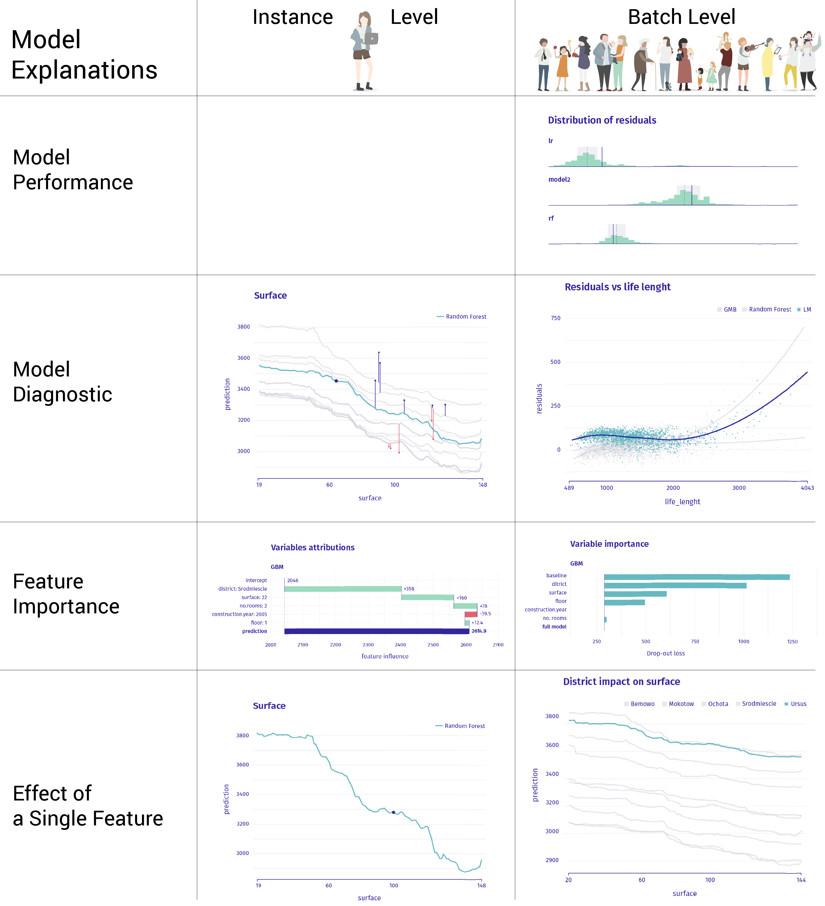

# DrWhy

`DrWhy` is the collection of tools for Explainable AI (XAI). It's based on shared principles and simple grammar for exploration, explanation and visualisation of predictive models.

Please, note that DrWhy is under rapid development and is still maturing. If you are looking for a stable solution, please use the mature [DALEX](https://github.com/pbiecek/DALEX/) package.

## Lifecycle for Predictive Models

*It takes a village to raise a <del>child</del> model*.

Tools that are usefull during the model lifetime.  stands for our internal tools.

### 1. Data Acquisition

* [dataMaid](https://cran.r-project.org/web/packages/dataMaid/index.html); A Suite of Checks for Identification of Potential Errors in a Data Frame as Part of the Data Screening Process
* [ggplot2](https://ggplot2.tidyverse.org/); System for declaratively creating graphics, based on The Grammar of Graphics.

### 2. Feature Selection

* Model Agnostic Variable Importance Scores. Surrogate learning = Train an elastic model and measure feature importance in such model. See [DALEX](https://github.com/pbiecek/DALEX/), [Model Class Reliance MCR](https://arxiv.org/abs/1801.01489) 
* [vip](https://github.com/koalaverse/vip) Variable importance plots 

### 3. Feature Engineering

* [SAFE](https://github.com/MI2DataLab/SAFE)  Surrogate learning = Train an elastic model and extract feature transformations. 
* [xspliner](https://github.com/ModelOriented/xspliner)  Using surrogate black-boxes to train interpretable spline based additive models 
* [factorMerger](https://github.com/MI2DataLab/factorMerger)  Set of tools for factors merging [paper](https://arxiv.org/abs/1709.04412)
* [ingredients](https://github.com/ModelOriented/ingredients)  Set of tools for model level feature effects and feature importance.

### 4. Model Tuning

* [mlr](https://github.com/mlr-org/mlr) Machine Learning in R [paper](http://jmlr.org/papers/v17/15-066.html)
* [caret](https://github.com/topepo/caret) Classification And Regression Training [paper](https://www.jstatsoft.org/article/view/v028i05)

### 5. Model Validation

* [auditor](https://github.com/MI2DataLab/auditor)  model verification, validation, and error analysis [vigniette](https://mi2datalab.github.io/auditor/articles/model_performance_audit.html)
* [DALEX](https://github.com/pbiecek/DALEX/)  Descriptive mAchine Learning EXplanations
* [iml](https://github.com/christophM/iml); interpretable machine learning R package
* [randomForestExplainer](https://github.com/MI2DataLab/randomForestExplainer)  A set of tools to understand what is happening inside a Random Forest
* [survxai](https://github.com/MI2DataLab/survxai)  Explanations for survival models [paper](http://joss.theoj.org/papers/dcc9d53e8a1b1f613d59b9658b113fff)

### 6. Model Deployment

* [breakDown](https://github.com/pbiecek/breakDown), [pyBreakDown](https://github.com/MI2DataLab/pyBreakDown) and [breakDown2](https://github.com/ModelOriented/breakDown2)  Model Agnostic Explainers for Individual Predictions (with interactions)
* [ceterisParibus](https://github.com/pbiecek/ceterisParibus), [pyCeterisParibus](https://github.com/ModelOriented/pyCeterisParibus), [ceterisParibusD3](https://github.com/MI2DataLab/ceterisParibusExt/tree/master/ceterisParibusD3) and [ceterisParibus2](https://github.com/ModelOriented/ceterisParibus2)  Ceteris Paribus Plots (What-If plots) for explanations of a single observation
* [localModel](https://github.com/ModelOriented/localModel) and [live](https://github.com/MI2DataLab/live/)  
LIME-like explanations with interpretable features based on Ceteris Paribus curves. 
* [lime](https://github.com/thomasp85/lime); Local Interpretable Model-Agnostic Explanations (R port of original Python package)
* [shapper](https://github.com/ModelOriented/shapper)  An R wrapper of SHAP python library
* [modelDown](https://github.com/MI2DataLab/modelDown)  modelDown generates a website with HTML summaries for predictive models

### 7. Model Maintenance

* [drifter](https://github.com/ModelOriented/drifter)  Concept Drift and Concept Shift Detection for Predictive Models
* [archivist](https://github.com/pbiecek/archivist)  A set of tools for datasets and plots archiving [paper](http://doi.org/10.18637/jss.v082.i11)

# DrWhy.AI indicator panel

## Active development and maintenance

These packages are actively developed and have active maintainer.

* archivist     (maintainer: [pbiecek](https://github.com/pbiecek))
* DALEX     (maintainer: [pbiecek](https://github.com/pbiecek))
* auditor     (maintainer: [agosiewska](https://github.com/agosiewska))
* survxai     (maintainer: [agosiewska](https://github.com/agosiewska))
* shapper     (maintainer: [agosiewska](https://github.com/agosiewska))
* iBreakDown    (maintainer: [pbiecek](https://github.com/pbiecek))
* ingredients    (maintainer: [pbiecek](https://github.com/pbiecek))
* drifter    (maintainer: [pbiecek](https://github.com/pbiecek))
* localModel    (maintainer: [mstaniak](https://github.com/mstaniak))

## Experimental pre-seed phase (under active development)

* EIX    (maintainer: [ekarbowiak](https://github.com/ekarbowiak))
* xspliner      (maintainer: [krystian8207](https://github.com/krystian8207))
* pyDALEX     (maintainer: [magda-tatarynowicz](https://github.com/magda-tatarynowicz))
* SAFE     (maintainer: [olagacek](https://github.com/olagacek))
* pyCeterisParibus     (maintainer: [kmichael08](https://github.com/kmichael08))
* ceterisParibusD3     (maintainer: [flaminka](https://github.com/flaminka))

## Experimental or without maintenance (looking for maintainer!!!)

These packages contain useful features, are still in use but we are looking for an active maintainer.

* randomForestExplainer     
* factorMerger    
* cr17    
* MLGenSig    
* modelDown    
* pyBreakDown   

## In the sunset phase, without maintenance

Key features from these packages are copied to another packages.

* ceterisParibus     (development moved to `ingredients`)
* ceterisParibus2     (development moved to `ingredients`)
* DALEX2    (development moved to `DALEX`)
* breakDown     (development moved to `iBreakDown`)
* live     (development moved to `localModel`)

## Family of Model Explainers

## Architecture of DrWhy

`DrWhy` works on fully trained predictive models. Models can be created with any tool. 

`DrWhy` uses `DALEX2` package to wrap model with additional matadata required for explanations, like validation data, predict function etc.

Explainers for predictive models can be created with model agnostic or model specific functions implemented in various packages.

